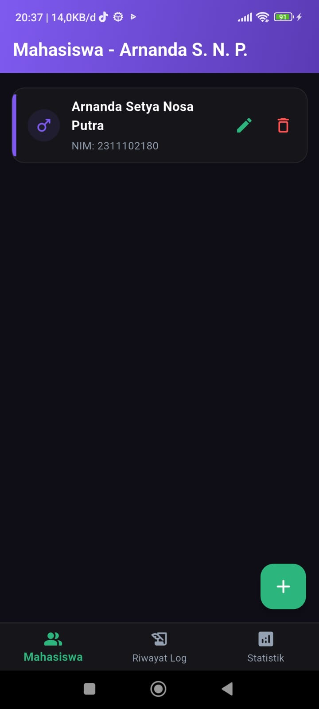
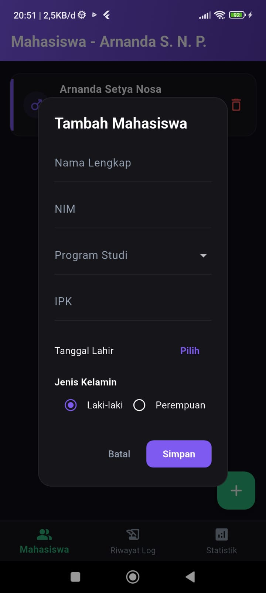
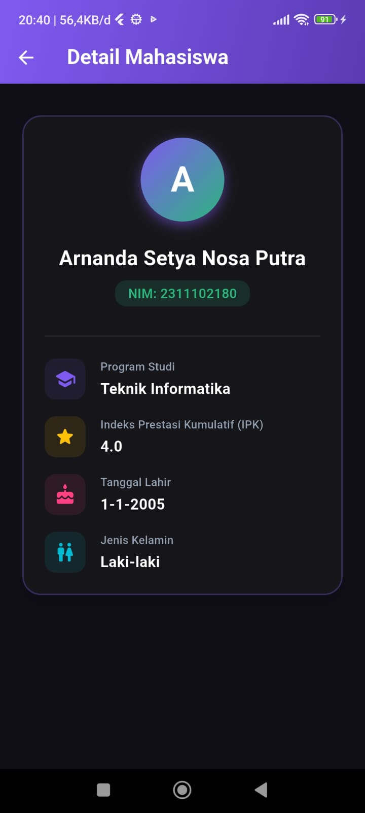
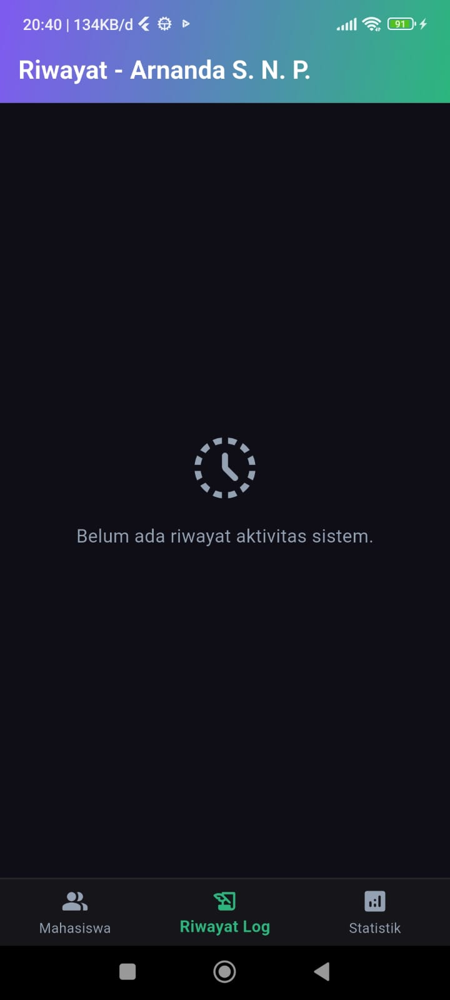
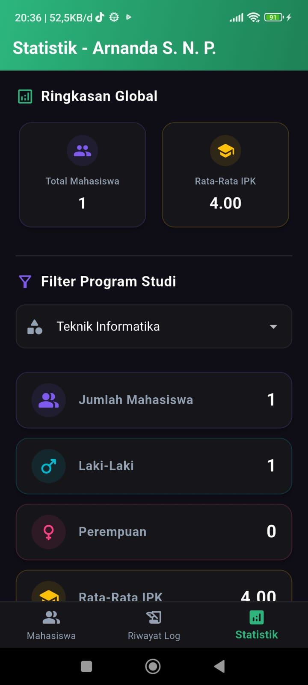
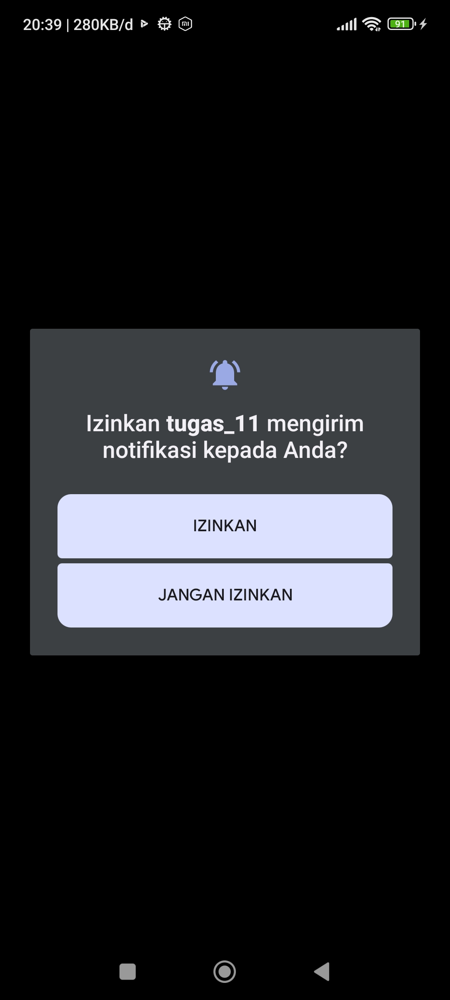
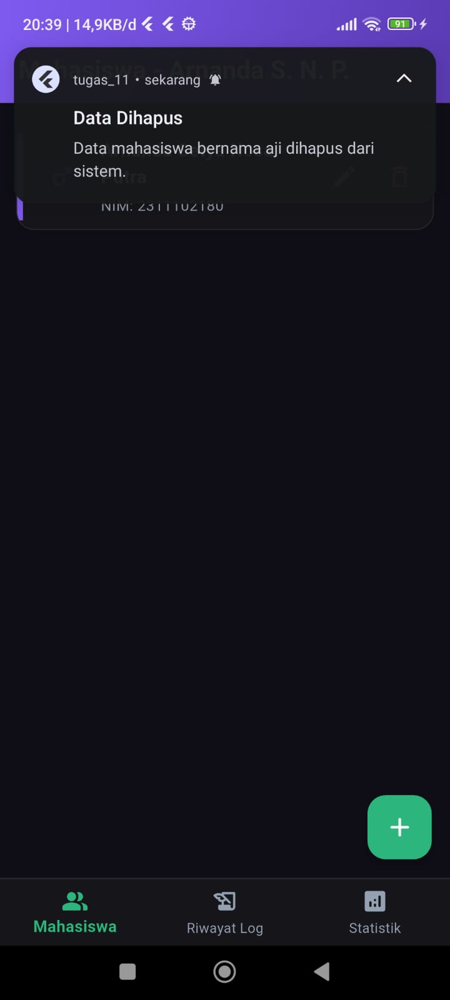

<div style="font-family: 'Times New Roman', Times, serif;">

<div align="center">
  <br />

  <h1>LAPORAN PRAKTIKUM <br>
  APLIKASI BERBASIS PLATFORM
  </h1>

  <br />

  <h3>TUGAS PERTEMUAN - 11<br>
    Praktikum Flutter — Local Notifications & CRUD Data Mahasiswa
  </h3>

  <br />

  

  <br />
  <br />
  <br />

  <h3>Disusun Oleh :</h3>

  <p>
    <strong>Afif Rijal Azzami</strong><br>
    <strong>2311102235</strong><br>
    <strong>S1 IF-11-04</strong>
  </p>

  <br />

  <h3>Dosen Pengampu :</h3>

  <p>
    <strong>Cahyo Prihantoro, S.Kom., M.Eng.</strong>
  </p>

  <br />

  <h3>LABORATORIUM HIGH PERFORMANCE
  <br>FAKULTAS INFORMATIKA <br>UNIVERSITAS TELKOM PURWOKERTO <br>2026</h3>
</div>

<hr>

## 1. Penjelasan Singkat

Pada tugas **Pertemuan 11** ini, praktikum berfokus pada pembuatan **Aplikasi Flutter** terstruktur yang mengelola data mahasiswa secara dinamis (CRUD) serta diintegrasikan dengan **notifikasi lokal (Local Notifications)** dan statistik analitik.

Konsep utama yang diterapkan:

1. **State Management & CRUD** : Pengelolaan list data mahasiswa dinamis menggunakan `setState` untuk operasi Create, Read, Update, dan Delete secara real-time. Form input dilengkapi validasi lengkap untuk nama, NIM, jurusan, IPK, tanggal lahir, dan jenis kelamin.

2. **Local Notifications** : Menggunakan package `flutter_local_notifications` untuk memunculkan notifikasi pop-up langsung ke system tray perangkat Android ketika terjadi penambahan, pembaruan, atau penghapusan data mahasiswa.

3. **Android Runtime Permissions (Android 13+)** : Meminta izin runtime `POST_NOTIFICATIONS` secara otomatis saat aplikasi pertama kali dibuka guna memastikan notifikasi tidak diblokir oleh OS Android modern.

4. **Desugaring & API Compatibility** : Mengonfigurasi gradle Android (`build.gradle.kts`) untuk mengaktifkan `isCoreLibraryDesugaringEnabled` agar library notifikasi dapat berjalan dengan aman pada berbagai versi sistem operasi Android.

5. **Organisasi Kode Terstruktur** : Membagi file proyek ke dalam folder modular (`models/` dan `screens/`) di dalam direktori `lib` untuk memastikan kode rapi, mudah dipelihara, dan terhindar dari kesamaan file.

6. **Desain Premium Tema Gelap (Deep Purple & Teal)** : Mengimplementasikan tema kustom modern bernuansa gelap dengan gradasi warna pada AppBar, sudut kartu membulat (Rounded Cards), serta bar vertikal berwarna sebagai indikator gender pada list mahasiswa.

---

## 2. Langkah-langkah Praktikum

### Langkah 1 — Inisialisasi Project Flutter

Buat project Flutter baru dan siapkan struktur folder yang terorganisir di dalam direktori `lib/`:

```
tugas-11/
├── lib/
│   ├── models/
│   ├── screens/
│   └── main.dart
├── pubspec.yaml
└── ...
```

---

### Langkah 2 — Tambahkan Dependencies di `pubspec.yaml`

Tambahkan package `flutter_local_notifications` pada file `pubspec.yaml` untuk mengaktifkan fitur notifikasi:

```yaml
dependencies:
  flutter:
    sdk: flutter
  flutter_local_notifications: ^21.0.0
  cupertino_icons: ^1.0.8
```

Lalu jalankan `flutter pub get` di terminal proyek.

---

### Langkah 3 — Konfigurasi Izin & Kompatibilitas Android

1. Di file `android/app/src/main/AndroidManifest.xml`, tambahkan izin notifikasi di bagian atas:
   ```xml
   <uses-permission android:name="android.permission.POST_NOTIFICATIONS"/>
   ```

2. Di file `android/app/build.gradle.kts`, aktifkan core library desugaring:
   ```kotlin
   compileOptions {
       sourceCompatibility = JavaVersion.VERSION_17
       targetCompatibility = JavaVersion.VERSION_17
       isCoreLibraryDesugaringEnabled = true
   }
   
   dependencies {
       coreLibraryDesugaring("com.android.tools:desugar_jdk_libs:2.1.4")
   }
   ```

---

### Langkah 4 — Buat Model Data Mahasiswa

Definisikan class `Mahasiswa` pada file `lib/models/mahasiswa_model.dart` untuk menstrukturkan data:

```dart
class Mahasiswa {
  String nama;
  String nim;
  String jurusan;
  double ipk; 
  DateTime tgllahir;
  bool gender;

  Mahasiswa({
    required this.nama,
    required this.nim,
    required this.jurusan,
    required this.ipk,
    required this.tgllahir,
    required this.gender,
  });
}
```

---

### Langkah 5 — Buat Halaman CRUD Mahasiswa

Halaman `lib/screens/mahasiswa_screen.dart` menampilkan daftar mahasiswa dengan gaya kartu modern. Operasi penambahan dan pengeditan data menggunakan modal `AlertDialog` yang disesuaikan ke tema gelap. 

Saat data berhasil disimpan/dihapus, notifikasi lokal akan ditembakkan ke HP:

```dart
Future<void> _tampilkanNotifikasi(String judul, String pesan) async {
  const AndroidNotificationDetails androidDetails = AndroidNotificationDetails(
    'crud_channel',
    'Notifikasi CRUD',
    importance: Importance.max,
    priority: Priority.high,
  );
  
  await flutterLocalNotificationsPlugin.show(
    id: DateTime.now().millisecondsSinceEpoch ~/ 1000,
    title: judul,
    body: pesan,
    notificationDetails: const NotificationDetails(android: androidDetails),
  );
}
```

---

### Langkah 6 — Buat Halaman Detail Mahasiswa

Halaman `lib/screens/detail_mahasiswa_screen.dart` menampilkan profil lengkap mahasiswa terpilih, menggunakan kontainer avatar melingkar bergradasi dan ikon deskriptif di setiap informasi detailnya.

---

### Langkah 7 — Buat Halaman Statistik Mahasiswa

Halaman `lib/screens/statistik_mahasiswa_screen.dart` menyediakan analisis data mahasiswa. Statistik menampilkan data global (Total mahasiswa & rata-rata IPK) serta data terfilter berdasarkan program studi (jumlah mahasiswa per prodi, persentase gender, dan rata-rata IPK jurusan).

---

### Langkah 8 — Buat Entrypoint Utama (`main.dart`)

File `lib/main.dart` menjadi pusat navigasi menggunakan `BottomNavigationBar` (mengelola tab Mahasiswa, Riwayat Log, dan Statistik). Pada file ini juga dilakukan inisialisasi awal notifikasi lokal, permintaan izin runtime untuk Android 13+, serta pre-populasi data dengan identitas Arnanda Setya Nosa Putra:

```dart
final List<Mahasiswa> dataMahasiswa = [
  Mahasiswa(
    nama: "Arnanda Setya Nosa Putra",
    nim: "2311102180",
    jurusan: "Teknik Informatika",
    ipk: 4.0,
    tgllahir: DateTime(2005, 1, 1),
    gender: true,
  ),
];
```

---

## 3. Struktur File

Struktur folder akhir dari project ini adalah sebagai berikut:

```
tugas-11/
├── android/
│   └── app/
│       ├── src/main/AndroidManifest.xml
│       └── build.gradle.kts
├── lib/
│   ├── models/
│   │   └── mahasiswa_model.dart             ← model data mahasiswa
│   ├── screens/
│   │   ├── detail_mahasiswa_screen.dart     ← halaman detail profil
│   │   ├── mahasiswa_screen.dart            ← halaman utama CRUD
│   │   └── statistik_mahasiswa_screen.dart  ← halaman analisis statistik
│   └── main.dart                            ← entrypoint, navigasi & log
└── pubspec.yaml
```

---

## 4. Ringkasan Aksi & Notifikasi

Aplikasi ini menggunakan perpaduan **Local Notifications** dan pencatatan **Riwayat Log** sistem pada setiap aksi CRUD:

| No | Aksi Pengguna | Judul Notifikasi | Detail Notifikasi | Efek ke Riwayat Log |
|:---:|:---|:---|:---|:---|
| 1 | Menambahkan mahasiswa baru | **Data Berhasil Ditambah!** | Mahasiswa [Nama] ditambahkan. | Mencatat waktu dan info penambahan |
| 2 | Memperbarui data mahasiswa | **Data Berhasil Diperbarui!** | Data [Nama] telah diubah. | Mencatat waktu dan info pembaruan |
| 3 | Menghapus data mahasiswa | **Data Dihapus** | Data mahasiswa bernama [Nama] dihapus dari sistem. | Mencatat waktu dan info penghapusan |

---

## 5. Cara Menjalankan Aplikasi

1. Sambungkan HP Android yang sudah diaktifkan **USB Debugging**-nya ke laptop.
2. Buka terminal di folder project `tugas-11`.
3. Jalankan perintah untuk mengunduh package:
   ```bash
   flutter pub get
   ```
4. Jalankan aplikasi ke perangkat Anda:
   ```bash
   flutter run
   ```
5. Izinkan permintaan akses notifikasi yang muncul di HP Anda.

---

## 6. Screenshot Hasil Tampilan

*(Silakan lakukan tangkapan layar (screenshot) pada HP Anda dan letakkan di dalam folder `SS` proyek dengan nama yang sesuai)*

<br>

<div align="center">

| No | Deskripsi Tampilan | File Gambar (Tempat Screenshot Anda) |
|:---:|:---|:---|
| 1 | Halaman Utama — Daftar Mahasiswa (Pre-populated) |  |
| 2 | Dialog Form — Tambah Mahasiswa Baru |  |
| 3 | Halaman Detail — Informasi Profil Mahasiswa |  |
| 4 | Halaman Riwayat Log — Daftar Aktivitas Sistem |  |
| 5 | Halaman Statistik — Analisis Global & Filter Prodi |  |
| 6 | Notifikasi HP — Muncul di Status Bar / System Tray |  <br/>  |

</div>

<br>

---

## 7. Kesimpulan

Pada tugas praktikum Pertemuan 11 ini, telah berhasil diimplementasikan:

1. **Aplikasi CRUD Data Mahasiswa** yang berjalan secara dinamis menggunakan State Management bawaan (`setState`) dengan validasi form input yang aman.
2. **Integrasi Local Notifications** menggunakan package `flutter_local_notifications` yang secara otomatis mengirimkan notifikasi instan ke HP pengguna pada setiap aktivitas database.
3. **Penerapan Runtime Permission** pada Android 13+ untuk meminta hak akses posting notifikasi sehingga kompatibel dengan sistem keamanan Android terbaru.
4. **Pemisahan Struktur File Modular** di mana file model ditempatkan pada folder `models/` dan file halaman antarmuka diletakkan pada folder `screens/` untuk menjaga kerapian kode.
5. **Tema Gelap Premium Kustom** dengan kombinasi warna Deep Purple dan Teal yang membedakan identitas visual aplikasi milik Arnanda dari template mahasiswa lainnya.

</div>
