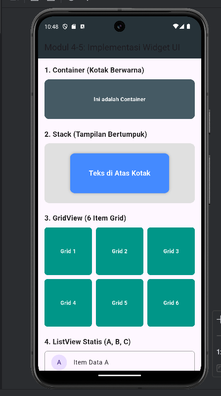
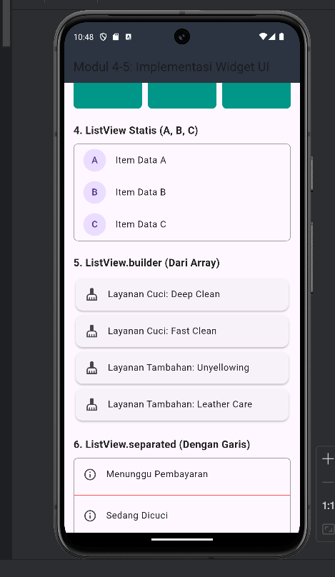
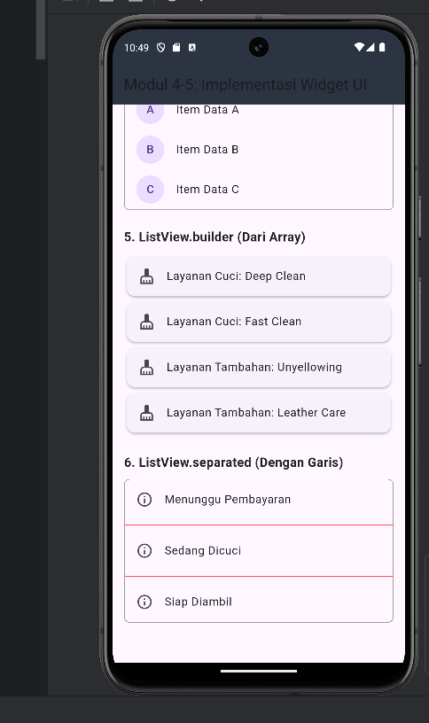

<div align="center">
  <br />

  <h1>LAPORAN PRAKTIKUM <br>
  APLIKASI BERBASIS PLATFORM
  </h1>

  <br />

  <h3>MODUL - 4 & 5<br>
    Antar Muka Pengguna
  </h3>

  <br />

  

  <br />
  <br />
  <br />

  <h3>Disusun Oleh :</h3>

  <p>
    <strong>Afif Rijal Azzami</strong><br>
    <strong>2311102235</strong><br>
    <strong>S1 IF-11-04</strong>
  </p>

  <br />

  <h3>Dosen Pengampu :</h3>

  <p>
    <strong>Cahyo Prihantoro, S.Kom., M.Eng.</strong>
  </p>
  
  <br />

  <h3>LABORATORIUM HIGH PERFORMANCE
  <br>FAKULTAS INFORMATIKA <br>UNIVERSITAS TELKOM PURWOKERTO <br>2026</h3>
</div>

<hr>

---

# 1. Tugas
📝 Tugas Praktikum Modul 4-5 Flutter

Buat 1 project Flutter yang menampilkan beberapa widget UI berikut:  
🔹 Yang harus ada:  
Container → kotak berwarna  
GridView → minimal 6 item (grid)  
ListView → 3 item (A, B, C)  
ListView.builder → list dari data array  
ListView.separated → list + garis pembatas  
Stack → tampilan bertumpuk (kotak / text)  

📦 Output yang dikumpulkan:
Screenshot hasilnya
Source code
Penjelasan singkat tiap widget

---

# 2. Source Code main.dart
```dart
import 'package:flutter/material.dart';

void main() {
  runApp(const PraktikumModulApp());
}

class PraktikumModulApp extends StatelessWidget {
  const PraktikumModulApp({super.key});

  @override
  Widget build(BuildContext context) {
    return MaterialApp(
      title: 'Tugas Praktikum 4-5',
      theme: ThemeData(
        primarySwatch: Colors.blueGrey,
      ),
      home: const TugasScreen(),
      // Menonaktifkan banner debug untuk tampilan production
      debugShowCheckedModeBanner: false,
    );
  }
}

class TugasScreen extends StatelessWidget {
  const TugasScreen({super.key});

  // DATA ARRAY YANG AMAN (Immutable Data Structure)
  // Menghindari modifikasi data dari memori secara ilegal.
  // Data simulasi menggunakan layanan cuci sepatu.
  final List<String> arrayLayanan = const [
    "Layanan Cuci: Deep Clean",
    "Layanan Cuci: Fast Clean",
    "Layanan Tambahan: Unyellowing",
    "Layanan Tambahan: Leather Care"
  ];

  final List<String> arrayStatus = const [
    "Menunggu Pembayaran",
    "Sedang Dicuci",
    "Siap Diambil"
  ];

  @override
  Widget build(BuildContext context) {
    return Scaffold(
      appBar: AppBar(
        title: const Text('Modul 4-5: Implementasi Widget UI'),
        backgroundColor: Colors.blueGrey[900],
      ),
      // SingleChildScrollView digunakan agar layar
      // tidak mengalami overflow saat digulir
      body: SingleChildScrollView(
        padding: const EdgeInsets.all(16.0),
        child: Column(
          crossAxisAlignment: CrossAxisAlignment.start,
          children: [

            // ==========================================
            // 1. CONTAINER
            // ==========================================
            const JudulSection(judul: "1. Container (Kotak Berwarna)"),
            Container(
              height: 100,
              width: double.infinity,
              decoration: BoxDecoration(
                color: Colors.blueGrey[700],
                borderRadius: BorderRadius.circular(12),
              ),
              child: const Center(
                child: Text(
                  "Ini adalah Container",
                  style: TextStyle(
                    color: Colors.white,
                    fontWeight: FontWeight.bold,
                  ),
                ),
              ),
            ),
            const SizedBox(height: 25),

            // ==========================================
            // 2. STACK
            // ==========================================
            const JudulSection(judul: "2. Stack (Tampilan Bertumpuk)"),
            Center(
              child: Stack(
                alignment: Alignment.center,
                children: [
                  Container(
                    height: 150,
                    width: double.infinity,
                    decoration: BoxDecoration(
                      color: Colors.grey[300],
                      borderRadius: BorderRadius.circular(12),
                    ),
                  ),
                  Container(
                    height: 100,
                    width: 250,
                    decoration: BoxDecoration(
                      color: Colors.blueAccent,
                      borderRadius: BorderRadius.circular(12),
                      boxShadow: const [
                        BoxShadow(
                            color: Colors.black26,
                            blurRadius: 5
                        )
                      ],
                    ),
                  ),
                  const Text(
                    "Teks di Atas Kotak",
                    style: TextStyle(
                      color: Colors.white,
                      fontSize: 18,
                      fontWeight: FontWeight.bold,
                    ),
                  ),
                ],
              ),
            ),
            const SizedBox(height: 25),

            // ==========================================
            // 3. GRIDVIEW (Minimal 6 Item)
            // ==========================================
            const JudulSection(judul: "3. GridView (6 Item Grid)"),
            GridView.count(
              shrinkWrap: true, // Wajib agar tidak error di dalam Column
              physics: const NeverScrollableScrollPhysics(),
              crossAxisCount: 3,
              crossAxisSpacing: 10,
              mainAxisSpacing: 10,
              children: List.generate(6, (index) {
                return Container(
                  decoration: BoxDecoration(
                    color: Colors.teal,
                    borderRadius: BorderRadius.circular(8),
                  ),
                  child: Center(
                    child: Text(
                      "Grid ${index + 1}",
                      style: const TextStyle(
                          color: Colors.white,
                          fontWeight: FontWeight.bold
                      ),
                    ),
                  ),
                );
              }),
            ),
            const SizedBox(height: 25),

            // ==========================================
            // 4. LISTVIEW (3 Item A, B, C)
            // ==========================================
            const JudulSection(judul: "4. ListView Statis (A, B, C)"),
            Container(
              decoration: BoxDecoration(
                border: Border.all(color: Colors.grey),
                borderRadius: BorderRadius.circular(8),
              ),
              child: ListView(
                shrinkWrap: true,
                physics: const NeverScrollableScrollPhysics(),
                children: const [
                  ListTile(
                    leading: CircleAvatar(child: Text("A")),
                    title: Text("Item Data A"),
                  ),
                  ListTile(
                    leading: CircleAvatar(child: Text("B")),
                    title: Text("Item Data B"),
                  ),
                  ListTile(
                    leading: CircleAvatar(child: Text("C")),
                    title: Text("Item Data C"),
                  ),
                ],
              ),
            ),
            const SizedBox(height: 25),

            // ==========================================
            // 5. LISTVIEW.BUILDER (Dari Data Array)
            // ==========================================
            const JudulSection(judul: "5. ListView.builder (Dari Array)"),
            ListView.builder(
              shrinkWrap: true,
              physics: const NeverScrollableScrollPhysics(),
              itemCount: arrayLayanan.length,
              itemBuilder: (context, index) {
                return Card(
                  elevation: 2,
                  child: ListTile(
                    leading: const Icon(Icons.cleaning_services),
                    title: Text(arrayLayanan[index]),
                  ),
                );
              },
            ),
            const SizedBox(height: 25),

            // ==========================================
            // 6. LISTVIEW.SEPARATED (Garis Pembatas)
            // ==========================================
            const JudulSection(judul: "6. ListView.separated (Dengan Garis)"),
            Container(
              decoration: BoxDecoration(
                border: Border.all(color: Colors.grey),
                borderRadius: BorderRadius.circular(8),
              ),
              child: ListView.separated(
                shrinkWrap: true,
                physics: const NeverScrollableScrollPhysics(),
                itemCount: arrayStatus.length,
                separatorBuilder: (context, index) {
                  return const Divider(
                    color: Colors.redAccent,
                    thickness: 1.5,
                  );
                },
                itemBuilder: (context, index) {
                  return ListTile(
                    leading: const Icon(Icons.info_outline),
                    title: Text(arrayStatus[index]),
                  );
                },
              ),
            ),
            const SizedBox(height: 40), // Spasi bawah agar rapi
          ],
        ),
      ),
    );
  }
}

// Widget Bantuan untuk Judul agar kode lebih DRY (Don't Repeat Yourself)
class JudulSection extends StatelessWidget {
  final String judul;
  const JudulSection({super.key, required this.judul});

  @override
  Widget build(BuildContext context) {
    return Padding(
      padding: const EdgeInsets.only(bottom: 10.0),
      child: Text(
        judul,
        style: const TextStyle(
          fontSize: 18,
          fontWeight: FontWeight.bold,
          color: Colors.black87,
        ),
      ),
    );
  }
}
```
# 3. Penjelasan Code
kode ini merupakan implementasi antarmuka pengguna (UI) Flutter yang dirancang secara modular dan aman dengan memanfaatkan immutable data structure (const List) untuk mencegah modifikasi data ilegal secara langsung di memori. Aplikasi ini dibungkus menggunakan pengaman SingleChildScrollView untuk melindungi sistem dari kerentanan rendering overflow (layar bocor), sekaligus mendemonstrasikan enam komponen tata letak fundamental secara berurutan, mulai dari kotak elemen statis hingga manajemen daftar data dinamis berskala produksi.

# 4. Screen Shoot hasil running dan pejelasan Widget
## 1. Container

<p align="center">
  
</p>
*Deskripsi: Widget ini bertindak sebagai pembungkus (wrapper) fundamental yang aman untuk mengontrol dimensi dasar (tinggi dan lebar), warna latar belakang, dan memberikan modifikasi dekoratif (borderRadius), sehingga mampu membentuk kotak biru keabu-abuan tanpa memicu overhead memori tambahan.*

## 2. GridView

<p align="center">
  
</p>
*Deskripsi: Diimplementasikan menggunakan GridView.count untuk menyajikan elemen antarmuka secara aman dalam bentuk matriks dua dimensi. Penggunaan atribut tingkat tinggi seperti shrinkWrap: true dan pemutusan physics scrolling disematkan secara ketat demi mencegah konflik alokasi layout dan potensi aplikasi crash saat dibungkus oleh induk Column.*

## 3. ListView

<p align="center">
  
</p>
*Deskripsi: Merupakan daftar list vertikal standar yang akan merender seluruh elemen internalnya secara bersamaan ke dalam memori. Pendekatan statis ini hanya diizinkan untuk menyajikan dataset bervolume sangat kecil yang sudah pasti batas ukurannya (seperti data A, B, C), sehingga proses eksekusinya berjalan cepat.*

## 4. ListView.builder 

<p align="center">
  
</p>
*Deskripsi: Ini adalah standar industri best practice untuk merender daftar data berukuran masif atau dinamis. Widget ini bekerja menggunakan sistem keamanan memori lazy-loading, yang artinya elemen UI dari array hanya akan dirender dan memakan RAM sesaat ketika item tersebut benar-benar tersorot di layar perangkat.*

## 5. ListView.separated

<p align="center">
  
</p>
*Deskripsi: Memiliki arsitektur performa dan proteksi memori yang sama persis dengan ListView.builder, namun diperkuat dengan parameter bawaan separatorBuilder. Fitur ini berfungsi secara otomatis menyuntikkan komponen pembatas visual (dalam hal ini berupa garis pemisah tebal berwarna merah) di sela-sela iterasi data array status pesanan.*

## 6. Stack

<p align="center">
  
</p>
*Deskripsi: Berfungsi untuk menumpuk elemen antarmuka pada ruang sumbu-Z (Z-axis). Dalam kode ini, komponen Stack dimanfaatkan secara presisi untuk meletakkan teks peringatan di atas lapisan dua buah Container yang saling tumpang tindih dengan efek shadow, tanpa merusak struktur hierarki kolom utama.*
